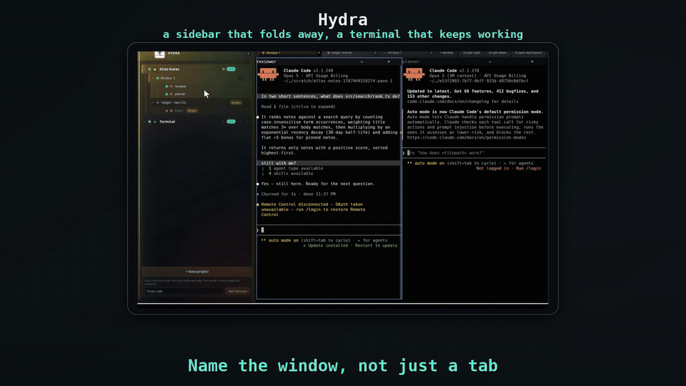

# Hydra

**Pick up the coding sessions you already started.**

Hydra is a local-first terminal workspace for macOS and Linux. Find existing coding-agent
sessions, organize them by project, and keep jobs running when you close the app.
Optional Remote access brings the same workspace to your browser or phone.

[Download](https://hydraterms.com/#install) · [What you can do](#what-you-can-do) ·
[First minute](#your-first-minute) · [Build with Remote](#open-source-and-hydra-remote) ·
[Privacy](https://hydraterms.com/privacy.html)

[](docs/assets/hydra-sidebar-82e88d7ec829.gif)

*8-second desktop demo: rename a window and collapse/reopen the sidebar.*

## What you can do

- **Find earlier work.** Point Hydra at a project folder and discover supported agents’ local
  session history, including sessions started outside Hydra.
- **Close the app, not the job.** A separate local daemon retains the live terminals when the
  desktop interface closes. Your machine must remain running.
- **Keep related work together.** Organize projects, windows and panes, with different agents
  beside one another.
- **Check the same terminal remotely.** Official packages include optional browser and phone
  access without exposing an inbound Hydra terminal port.

Closing the app is not rebooting the machine. A reboot ends running processes; supported agent
conversations can resume in new processes. See [retention and other limits](FAQ.md).

## Install

Local desktop use does not require a Hydra account. Your chosen agent may need its own login.

macOS with Homebrew:

```sh
brew install --cask hydraterm/hydra/hydraterms
```

Ubuntu/Debian through the official installer:

```sh
curl -fsSL https://hydraterms.com/install.sh | sh
```

Prefer to inspect the installer first? [Read install.sh](https://hydraterms.com/install.sh).
[Direct packages and portable archives](https://hydraterms.com/#direct-downloads-heading)
are also available. Check the installation page for supported formats and architectures.

Official packages include Hydra Remote integration. This repository contains the local desktop
and separately buildable Remote engine/agent source, not the hosted account website or service access.

## Your first minute

1. Open Hydra and choose **New project**.
2. Choose a folder where you have already used a supported coding agent.
3. Select that agent and look for a previous session in the project dialog.
4. Choose the session to resume, then create the project.
5. Add windows or split panes as you need them.

No sessions listed? Check the selected folder, provider and operating-system user first.
History support differs between providers. See [provider interoperability](#provider-interoperability)
and [troubleshooting](TROUBLESHOOTING.md).

[](https://hydraterms.com/assets/product/resume-bebc33e22155.webp)

*Real product capture. Open it at full size to inspect the previous-session list.
Permission-bypass options visible in this older capture are not needed for discovery or resume.*

## Help and developer resources

- [Frequently asked questions](FAQ.md) — retention, provider support, Remote and security.
- [Troubleshooting](TROUBLESHOOTING.md) — discovery, local-data migration and Linux display backends.
- [Remote engine quickstart](docs/developer/remote-core-quickstart.md) — build the browser engine
  and broker for your own integration.
- [Remote agent build guide](hydra-agent/README.md) — build the desktop/headless agent separately.
- [Architecture](docs/architecture.md) — PTY ownership, native rendering and desktop composition.
- [Development](DEVELOPMENT.md) and [contributing](CONTRIBUTING.md) — build, test and contribution contracts.

## What is in this repository

- the PTY daemon and retained-session model;
- the native terminal renderer;
- local projects, windows, panes and layouts;
- local provider and previous-session discovery;
- the desktop dashboard;
- local macOS and Linux platform support;
- the bounded API used to request optional desktop extensions;
- the authenticated Remote agent (see [its build guide](hydra-agent/README.md));
- the browser terminal/controller engine and WebRTC transport in `web-client`; and
- the content-blind signaling broker in `hydra-cloud`.

### Provider interoperability

Hydra reads provider-owned local session metadata so it can list and resume sessions created by
Claude Code, Codex CLI, GitHub Copilot CLI, Antigravity, Kimi CLI, Kiro CLI, OpenCode, Cursor Agent,
Devin CLI and the legacy Gemini CLI. These on-disk formats belong to their providers and may change.
Discovery runs locally; HydraTerms does not receive transcript content. Amp and Factory/Droid can
be launched and resumed through their CLIs, but Hydra does not read their history stores.

## Open source and Hydra Remote

The local desktop, desktop/headless Remote agent, browser terminal/controller engine and
signaling broker in this repository are open source under the [MIT License](LICENSE).
They can be inspected, built, forked and extended without Clerk or Stripe dependencies.

The browser engine provides terminal rendering, session/layout control, reconnect and encrypted
transport. The agent authenticates and authorizes remote operations before forwarding them to
retained local PTYs. Independent integrations supply services through the typed interfaces.

The hosted account website and its surrounding UI, Clerk/Stripe integrations, hosted enrollment
and authorization-service composition, billing operations, deployment configuration and relay
infrastructure remain private. This is a source release, not a turnkey self-hosted service or
a new installer. Building the source does not grant access to HydraTerms' hosted service.

See the [browser/broker quickstart](docs/developer/remote-core-quickstart.md),
[agent build guide](hydra-agent/README.md) and [public/private boundary](docs/public-private-boundary.md).

## Build

Install the prerequisites in [DEVELOPMENT.md](DEVELOPMENT.md), then run:

```sh
./scripts/build-local.sh
cargo run -p maestro-app -- launch
```

That `cargo run` command is the fast, isolated developer harness. It uses development-only state
and is not the installed application topology. To exercise the local desktop through the same
launcher, daemon-retention and bundled-dashboard shape as a package, use the unsigned packaging
and launch instructions in [DEVELOPMENT.md](DEVELOPMENT.md).

The repository pins the normal contributor Rust toolchain separately from its minimum supported
Rust version. See DEVELOPMENT.md before substituting toolchain versions.

## Test

```sh
./scripts/test-local.sh
```

The repository also contains local-only unsigned packaging smoke scripts for macOS and Linux.
They do not bundle the separately built Remote agent or produce an official signed release; see
[DEVELOPMENT.md](DEVELOPMENT.md).

Platform UI behavior still needs physical testing on macOS and, on Linux, both native Wayland and
X11. A browser-only dashboard test does not prove native host behavior.

### Compatibility names

Hydra is the product name. Some crates, environment variables, schemas and durable state paths
retain `maestro-*`, `MAESTRO_*`, `maestro.*` or `Maestro` names so existing local data and extension
interfaces remain compatible. They are stable implementation identifiers, not a second product or
a hidden remote component; changing them requires an explicit data migration.

## Contributing

Bug fixes, documentation, platform compatibility and packaging improvements are welcome.
Architectural changes require an accepted issue before implementation. See
[CONTRIBUTING.md](CONTRIBUTING.md) and [DEVELOPMENT.md](DEVELOPMENT.md).

Every contribution uses the [Developer Certificate of Origin](DCO.md). Sign off each commit with
`git commit -s`; the required DCO check verifies every pull request. HydraTerms does not require a
contributor licence agreement or copyright assignment.

## Security

Do not report vulnerabilities in a public issue. Follow [SECURITY.md](SECURITY.md) or email
[security@hydraterms.com](mailto:security@hydraterms.com).

## Licence and marks

First-party code in this repository is licensed under the [MIT License](LICENSE). That licence
does not include the private hosted service or account website, and it grants no rights
to HydraTerms names or logos. See [TRADEMARKS.md](TRADEMARKS.md).

Third-party dependencies retain their own licences; see [THIRD_PARTY_NOTICES.md](THIRD_PARTY_NOTICES.md).
Previously published Apache-2.0 versions remain available under their original licence grants.

## Sponsor

Hydra's development is funded by [Pairextr Teknoloji ve Yazılım A.Ş.](https://www.pairextr.com/)
Hydra and HydraTerms remain marks of HydraTerms Limited; sponsorship grants no ownership of the
project or its marks.
