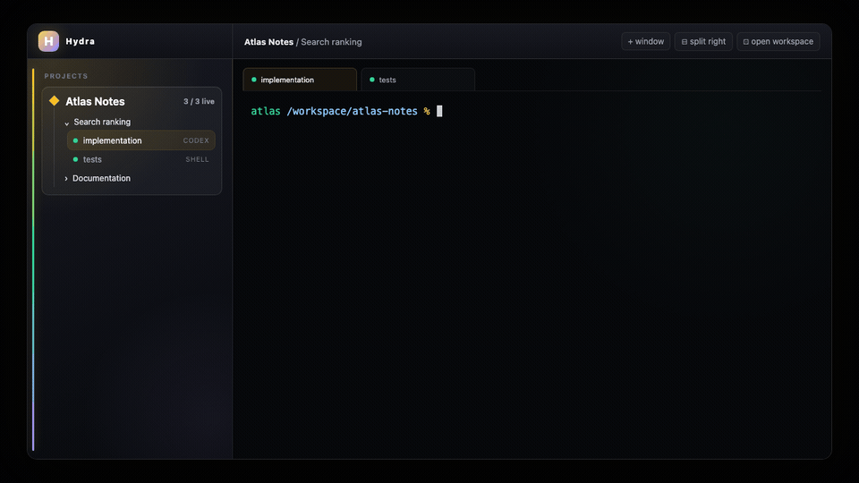

# Hydra



*Synthetic product illustration; no account, terminal transcript, personal path or live desktop was
recorded.*

Hydra is a local-first terminal desktop for working with terminal sessions and coding agents.
Projects, windows, panes, terminal history and retained PTY sessions live on your machine.

## Start here

- [Frequently asked questions](FAQ.md) — tmux, Electron, retention, Remote, security and Herdr.
- [Architecture](docs/architecture.md) — PTY ownership, native rendering, dashboard composition and
  the macOS/Linux host split.
- [Troubleshooting](TROUBLESHOOTING.md) — local-data migration, agent discovery and Linux display
  backends.
- [Development](DEVELOPMENT.md) and [contributing](CONTRIBUTING.md) — build, test and contribution
  contracts.

## Install

Official macOS package:

```sh
brew install --cask hydraterm/hydra/hydraterms
```

Official Linux package:

```sh
curl -fsSL https://hydraterms.com/install.sh | sh
```

Official packages include the separate proprietary Hydra Remote component. A source build from
this repository is a complete local desktop; it does not include the private remote agent or access
to the hosted service.

## What is in this repository

- the PTY daemon and retained-session model;
- the native terminal renderer;
- local projects, windows, panes and layouts;
- local provider and previous-session discovery;
- the desktop dashboard;
- local macOS and Linux platform support; and
- the bounded API used to request optional desktop extensions.

### Provider interoperability

Hydra reads provider-owned local session metadata so it can list and resume sessions created by
Claude Code, Codex CLI, GitHub Copilot CLI, Antigravity, Kimi CLI, Kiro CLI, OpenCode, Cursor Agent,
Devin CLI and the legacy Gemini CLI. These on-disk formats belong to their providers and may change.
Discovery runs locally; HydraTerms does not receive transcript content. Amp and Factory/Droid can
be launched and resumed through their CLIs, but Hydra does not read their history stores.

## Open source and Hydra Remote

This repository contains Hydra's local desktop. You can inspect it, build it, fork it and propose
changes under the Apache License 2.0.

Hydra Remote is a separate hosted product. Its desktop agent, browser client, coordination service,
relays, identity, entitlement and billing systems are not in this repository and are not open
source. The private agent, not this application, decides whether a remote peer is authenticated and
authorized.

We publish the local desktop so that the code which owns terminal sessions and runs on your machine
can be reviewed. See [the public/private boundary](docs/public-private-boundary.md) for the exact
scope and threat model.

## Build

Install the prerequisites in [DEVELOPMENT.md](DEVELOPMENT.md), then run:

```sh
./scripts/build-local.sh
cargo run -p maestro-app -- launch
```

That `cargo run` command is the fast, isolated developer harness. It uses development-only state
and is not the installed application topology. To exercise the local desktop through the same
launcher, daemon-retention and bundled-dashboard shape as a package, use the unsigned packaging
and launch instructions in [DEVELOPMENT.md](DEVELOPMENT.md).

The repository pins the normal contributor Rust toolchain separately from its minimum supported
Rust version. See DEVELOPMENT.md before substituting toolchain versions.

## Test

```sh
./scripts/test-local.sh
```

The repository also contains local-only unsigned packaging smoke scripts for macOS and Linux.
They never bundle the proprietary remote agent and do not produce an official signed release; see
[DEVELOPMENT.md](DEVELOPMENT.md).

Platform UI behavior still needs physical testing on macOS and, on Linux, both native Wayland and
X11. A browser-only dashboard test does not prove native host behavior.

### Compatibility names

Hydra is the product name. Some crates, environment variables, schemas and durable state paths
retain `maestro-*`, `MAESTRO_*`, `maestro.*` or `Maestro` names so existing local data and extension
interfaces remain compatible. They are stable implementation identifiers, not a second product or
a hidden remote component; changing them requires an explicit data migration.

## Contributing

Bug fixes, documentation, platform compatibility and packaging improvements are welcome.
Architectural changes require an accepted issue before implementation. See
[CONTRIBUTING.md](CONTRIBUTING.md) and [DEVELOPMENT.md](DEVELOPMENT.md).

Every contribution uses the [Developer Certificate of Origin](DCO.md). Sign off each commit with
`git commit -s`; the required DCO check verifies every pull request. HydraTerms does not require a
contributor licence agreement or copyright assignment.

## Security

Do not report vulnerabilities in a public issue. Follow [SECURITY.md](SECURITY.md) or email
[security@hydraterms.com](mailto:security@hydraterms.com).

## Licence and marks

Hydra's local desktop is licensed under the Apache License 2.0. That licence does not include the
private Hydra Remote implementation or hosted service, and it grants no rights to HydraTerms names
or logos. See [TRADEMARKS.md](TRADEMARKS.md).
